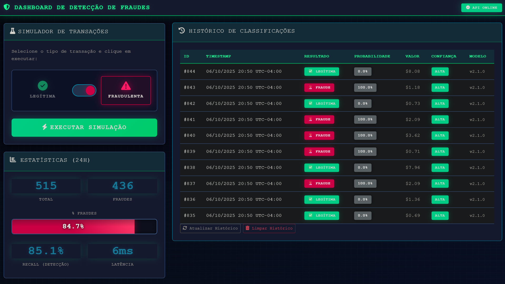

# 🚨 Sistema de Detecção de Fraude em Cartão de Crédito

Sistema completo de **Machine Learning para detecção de fraude** com pipeline modular, PostgreSQL para persistência, CLI interativo e **Dashboard Web Interativo**. Feito com intuito de servir de projeto para o Tech Challenge Fase 3 - FIAP.

---

## 🚀 Teste Agora! (Quick Demo)

**Quer ver o sistema funcionando?** Execute o dashboard em 3 passos:

```bash
# 1. Inicie o servidor Flask
python run.py

# 2. Acesse no navegador
# http://127.0.0.1:5000

# 3. Teste o detector!
#    → Clique no botão "LEGÍTIMA" ou "FRAUDULENTA"
#    → Clique em "EXECUTAR SIMULAÇÃO"
#    → Veja o resultado em tempo real com:
#       ✅ Predição do modelo (o que o XGBoost classificou)
#       🎯 Ground Truth (o que a transação realmente é)
#       📊 Probabilidade de fraude (0-100%)
#       🔍 Confiança da predição (ALTA/MODERADA/BAIXA)
#       ⚡ Latência de inferência (tempo real medido)
```

**🎯 O que você vai ver:**
- **Painel de Simulação**: Selecione tipo de transação e simule em 1 clique
- **Estatísticas em Tempo Real**: Total, fraudes detectadas, Recall (taxa de detecção), latência
- **Histórico Completo**: Todas as classificações com predição vs realidade 

> 💡 **Dica**: Simule várias transações fraudulentas e veja o modelo errando algumas (~15% de erro). Isso mostra que o modelo é **realista** e não overfitted!

---

## 🎯 Objetivo

Desenvolver sistema de detecção de fraude usando **XGBoost otimizado** com:
- ✅ Tratamento de dados **altamente desbalanceados** (ratio 1:578)
- ✅ Pipeline modular MVC-ML (processamento → treinamento → inferência)
- ✅ Validação robusta com **StratifiedKFold**
- ✅ **Grid Search automatizado** com versionamento de hiperparâmetros
- ✅ **PostgreSQL** (dados) + **Pickle** (modelos) para rastreabilidade
- ✅ **CLI completo** (pipeline/train/tune/predict) com 4 modos de operação
- ✅ **Backend Flask REST API** com simulação de transações em tempo real
- ✅ **Dashboard Web Interativo** com estatísticas, histórico e visualização de resultados
---

## 🏗️ Arquitetura do Projeto

### Estrutura MVC-ML + Services Layer

O projeto segue uma **arquitetura modular em camadas** que separa responsabilidades:
- **Model (M)**: `src/models/` - SQLAlchemy ORM + ML configs
- **View (V)**: `src/services/frontend/` - Templates HTML + Assets estáticos
- **Controller (C)**: `src/services/backend/` - Flask routes + Business logic
- **ML Pipeline**: `src/ml/` - Processamento de dados + Treinamento
- **Services**: `src/services/` - Camadas de infraestrutura (Database, ML, Frontend, Backend)

```
ml-fraud-detector/
├── data/                        # 📊 Datasets e configurações
│   ├── archive/                 # Versões antigas de hiperparâmetros
│   ├── examples/                # Exemplos de transações para teste
│   │   ├── fraud_transaction.json
│   │   └── legitimate_transaction.json
│   ├── creditcard.csv           # Dataset original (284,807 transações)
│   └── xgboost_hyperparameters.json  # ⚙️ Hiperparâmetros ativos
│
├── database/                    # �️ Configuração PostgreSQL
│   ├── migrations/              # Scripts SQL de migração
│   │   └── create_webapp_tables.sql
│   ├── docker-compose.yml       # Docker setup (PostgreSQL 15)
│   └── schema.sql               # Schema completo (7 tabelas pipeline + 2 webapp)
│
├── docs/                        # 📚 Documentação técnica
│   ├── images/                  # Gráficos e screenshots
│   ├── API_ENDPOINTS.md         # Documentação REST API 
│   ├── DATA_ARCHITECTURE.md     # Arquitetura PostgreSQL + Pickle
│   ├── DECISOES_TECNICAS.md     # Decisões ML + otimizações
│   ├── EDA_REPORT.md            # Análise exploratória completa 
│   ├── MODEL_SELECTION.md       # Comparação de 4 modelos
│   ├── TRANSACTION_EXAMPLES.md  # Exemplos práticos 
│
├── models/                      # 🤖 Modelos treinados (Pickle)
│   ├── archive/                 # Versões antigas de modelos
│   ├── scalers.pkl              # RobustScaler + StandardScaler
│   └── xgboost_v2.1.0.pkl       # ⭐ Modelo em produção
│
├── reports/                     # 📈 Relatórios gerados (JSON)
│   └── feature_selection_analysis.json
│
├── src/                         # 💻 Código fonte
│   ├── ml/                      # 🧠 Machine Learning Pipeline
│   │   ├── models/              # ⚙️ Configurações
│   │   │   ├── __init__.py
│   │   │   └── configs.py       # Dataclasses + JSON loader
│   │   ├── pipelines/           # 🚀 Orquestração
│   │   │   ├── __init__.py
│   │   │   └── data_pipeline.py # Steps 01-07 (completo)
│   │   ├── processing/          # 🔧 Funções de processamento
│   │   │   ├── __init__.py
│   │   │   ├── cleaning.py      # Análise de outliers
│   │   │   ├── feature_engineering.py  # 9 novas features
│   │   │   ├── feature_selection.py    # Análise automatizada
│   │   │   ├── loader.py        # PostgreSQL COPY (otimizado 81.6%)
│   │   │   ├── metadata.py      # Pipeline metadata tracking
│   │   │   ├── normalization.py # RobustScaler + StandardScaler
│   │   │   ├── splitters.py     # Stratified train/test split
│   │   │   └── validation.py    # Schema e integridade
│   │   ├── training/            # 🎓 Treinamento ML
│   │   │   ├── __init__.py
│   │   │   ├── train.py         # Treino com JSON configs
│   │   │   └── tune.py          # Grid Search + auto-update JSON
│   │   ├── README.md            # Documentação MVC-ML
│   │   └── __init__.py
│   │
│   ├── models/                  # 📦 Data Models (SQLAlchemy ORM)
│   │   ├── __init__.py
│   │   └── database_models.py   # ORM models (pipeline + webapp)
│   │
│   ├── services/                # 🔌 Services Layer (Infraestrutura)
│   │   ├── backend/             # ⚙️ Backend Flask (Controller)
│   │   │   ├── __init__.py      # Factory pattern (create_app)
│   │   │   ├── config.py        # Configurações (Dev/Prod/Test)
│   │   │   └── routes.py        # REST endpoints
│   │   ├── database/            # �️ Database Service (PostgreSQL)
│   │   │   ├── __init__.py
│   │   │   ├── connection.py    # Engine + connection pooling
│   │   │   └── database_service.py  # CRUD para webapp
│   │   ├── frontend/            # 🎨 Frontend Assets (View)
│   │   │   ├── static/
│   │   │   │   ├── css/
│   │   │   │   │   └── style.css    # Tema cyberpunk customizado
│   │   │   │   └── js/
│   │   │   │       └── app.js       # Lógica do dashboard
│   │   │   └── templates/
│   │   │       └── index.html       # Dashboard HTML principal
│   │   └── ml/                  # 🤖 ML Services (Inferência)
│   │       ├── __init__.py
│   │       ├── model_service.py      # Singleton para predições
│   │       └── transaction_generator.py  # Gerador de transações
│   └── __init__.py
│
├── main.py                      # 🎯 CLI principal (pipeline/train/tune/predict)
├── run.py                       # 🚀 Inicializador Flask (entry point)
├── pyproject.toml               # Configuração do projeto (uv/pip)
├── requirements.txt             # Dependências Python
├── uv.lock                      # Lock file do uv
└── README.md                    # Este arquivo
```


### Pipeline de Dados (7 Steps)
```
┌──────────────────────────────────────────────────────────────────────┐
│                    DATA PROCESSING PIPELINE                          │
├──────────────────────────────────────────────────────────────────────┤
│                                                                      │
│  CSV Raw (284,807) → [01] Load Raw → PostgreSQL (raw_transactions)   │
│                         ↓                                            │
│                    [02] Outlier Analysis → Metadata only             │
│                         ↓                                            │
│                    [03] Missing Values → Metadata only               │
│                         ↓                                            │
│                    [04] Normalize → PostgreSQL + scalers.pkl         │
│                         ↓                                            │
│                    [05] Feature Engineering → PostgreSQL (40 cols)   │
│                         ↓ (Time_Period, Amount_Log, stats)           │
│                    [05.5] Feature Selection Analysis → JSON Report   │
│                         ↓ (Pearson, Spearman, MI, VIF)               │
│                    [06] Apply Feature Selection → PostgreSQL (33)    │
│                         ↓ (Config-driven removal)                    │
│                    [07] Train/Test Split → train_data + test_data    │
│                         ↓ (StratifiedKFold 80/20)                    │
│                                                                      │ 
└──────────────────────────────────────────────────────────────────────┘
```

### Arquitetura de Persistência

**PostgreSQL - Tabelas do Pipeline**:
- `raw_transactions` (284,807 linhas): CSV original
- `cleaned_transactions` (284,804 linhas): Sem outliers
- `imputed_transactions` (284,804 linhas): Sem missing values
- `normalized_transactions` (284,804 linhas): Features normalizadas
- `engineered_transactions` (284,804 linhas): Adição de features novas 
- `train_features` (~227,843 linhas): 80% treino
- `test_features` (~56,961 linhas): 20% teste

**PostgreSQL - Tabelas do Webapp** (✅ **IMPLEMENTADAS**):
- `classification_results`: Histórico de predições do dashboard
  - `model_version`, `predicted_at`, `is_fraud`, `fraud_probability`
  - `transaction_features` (JSONB com 33 features)
  - Índices: `predicted_at`, `is_fraud`, `model_version`
- `simulated_transactions`: Transações geradas pelo simulador
  - `transaction_type` ('legitimate', 'fraud')
  - `features` (JSONB), `classification_id` (FK)

**PostgreSQL - Tabelas de Metadados** (🔮 FUTURO - não implementadas):
- `metrics_history`: Métricas de modelos ao longo do tempo
- `trained_models`: Registro de modelos treinados com timestamps
- `data_splits`: Histórico de splits train/test

**Pickle (modelos ML)**:
- `models/scalers.pkl`: RobustScaler + StandardScaler (fit em train)
- `models/xgboost_v2.1.0.pkl`: Modelo final em produção ⭐

**JSON (hiperparâmetros versionados)**:
- `data/xgboost_hyperparameters.json`: Hiperparâmetros ativos
- `data/archive/`: Versões anteriores com timestamp automático

**Por que híbrido?**
- **PostgreSQL**: Rastreabilidade, SQL analytics, backups automáticos, histórico webapp
- **Pickle**: Fast loading (~0.1s), métodos do objeto preservados, scikit-learn nativo
- **JSON**: Versionamento de hiperparâmetros, comparações dinâmicas, production-ready

### Stack Tecnológico
- **Data Pipeline**: Python 3.13 + Pandas + PostgreSQL 15
- **ML Model**: XGBoost 3.0.5 (scale_pos_weight=577, max_depth=6)
- **Backend API**: Flask 3.0.3 + SQLAlchemy (REST endpoints)
- **Persistência**: PostgreSQL (dados + histórico webapp) + Pickle (modelos)
- **Otimização**: PostgreSQL COPY, ThreadPoolExecutor, metadata-only steps
- **Infraestrutura**: Docker Compose (PostgreSQL)

---

## 📊 Dataset

- **Fonte**: Kaggle - Credit Card Fraud Detection
- **Transações**: 284.807 (2 dias, setembro 2013)
- **Features**: 30 (Time, Amount, V1-V28 via PCA)
- **Target**: Class (0=legítima, 1=fraude)
- **Desbalanceamento**: 492 fraudes (0.172%) vs 284.315 legítimas

---

## 🚀 Quick Start

### 1. Pré-requisitos
- Python 3.13+
- PostgreSQL 15+ (ou Docker)
- 2GB+ RAM disponível

### 2. Instalação

```bash
# Clone do repositório
git clone <repo-url>
cd ml-fraud-detector

# Criar ambiente virtual
python3 -m venv .venv
source .venv/bin/activate  # Linux/Mac
# .venv\Scripts\activate   # Windows

# Instalar dependências
pip install -r requirements.txt

# OU usando uv (mais rápido)
uv pip install -e .
```

### 3. Configurar PostgreSQL

**Opção A: Docker (Recomendado)**
```bash
cd database
docker-compose up -d

# Validar conexão
docker exec -it fraud_detection_postgres psql -U fraud_user -d fraud_detection -c "\dt"
```

**Opção B: PostgreSQL Local**
```bash
# Criar banco e usuário
createdb fraud_detection
createuser fraud_user --password fraud_pass_dev

# Aplicar schema
psql -U fraud_user -d fraud_detection -f database/schema.sql
```

### 4. Executar Pipeline de Dados

```bash
# Opção 1: Via CLI (RECOMENDADO)
python main.py pipeline

# Opção 2: Direto (legacy)
python -m src.ml.pipelines.data_pipeline

# Resultado esperado (~62s):
# ✅ raw_transactions: 284,807 linhas
# ✅ cleaned_transactions: 284,804 linhas (outliers removidos)
# ✅ imputed_transactions: 284,804 linhas (missing tratados)
# ✅ normalized_transactions: 284,804 linhas (RobustScaler aplicado)
# ✅ engineered_transactions: 284,804 linhas (40 features)
# ✅ train_features: ~227,843 linhas (394 fraudes)
# ✅ test_features: ~56,961 linhas (98 fraudes)
# ✅ scalers.pkl salvo em models/
```

---

## 🖥️ CLI Principal (`main.py`)

O projeto inclui um **CLI completo** com 4 modos de operação:

### Modo 1: Pipeline (Processamento de Dados)

Executa pipeline completo de dados (Steps 01-07, ~62s):

```bash
# Pipeline completo
python main.py pipeline

# Saída esperada: 
# ✅ Pipeline completo!
# 📊 Resultado esperado:
#    ✅ train_features: ~227,843 linhas (394 fraudes)
#    ✅ test_features: ~56,961 linhas (98 fraudes)
#    ✅ scalers.pkl salvo em models/
# 
# 💡 Próximo passo: python main.py train
```

**Quando usar**: Primeira vez ou após mudanças no dataset original.
 


### Modo 2: Train (Treinamento Rápido)

Treina modelo usando hiperparâmetros de `data/xgboost_hyperparameters.json` (~1 min):

```bash
# Treinar XGBoost com JSON ativo (assume dados já no PostgreSQL)
python main.py train

# Especificar versão personalizada
python main.py train --model-version 2.1.1

# Overwrite modelo existente (move antigo para models/archive/)
python main.py train --model-version 2.1.0 -ow

# Saída esperada:
# 🚀 MODO: TREINAMENTO
# ✅ Train: 227,845 linhas (394 fraudes)
# ✅ Test: 56,962 linhas (98 fraudes)
# 📊 Cross-Validation (StratifiedKFold k=5)...
#    Precision (CV): 0.8123 ± 0.0234
#    Recall (CV): 0.8456 ± 0.0189
# ✅ Modelo salvo: models/xgboost_v2.1.0.pkl
#    PR-AUC: 0.8772
#    Precision: 86.60%
#    False Positives: 13
```

**Versionamento Automático:**
- **Sem `-ow`**: Salva em `models/archive/xgboost_v{version}_{timestamp}.pkl`
- **Com `-ow`**: Move modelo antigo para archive e cria novo em `models/`

**Quando usar**: Treinar rapidamente com parâmetros conhecidos bons (JSON ativo).

---

### Modo 3: Tune (Grid Search Automático)

Executa **Grid Search** (~20 min) e **atualiza `data/xgboost_hyperparameters.json`** automaticamente:

```bash
# Grid Search (modo archive - padrão)
python main.py tune

# Grid Search + overwrite do JSON ativo
python main.py tune -ow

# Especificar versão otimizada
python main.py tune --model-version 3.0.0 -ow

# Saída esperada:
# 🔧 Executando Grid Search...
# ✅ Grid Search completo!
# 🏆 Melhores Parâmetros:
#    colsample_bytree: 0.7
#    learning_rate: 0.3
#    max_depth: 6
#    ...
#    PR-AUC: 0.8772
#    Atualizando configs.py com melhores hiperparâmetros...
#    ✅ configs.py atualizado!
```

**Quando usar**: 
- Otimizar hiperparâmetros após mudanças no dataset (novas features, etc.)
- Experimentar novos grids de busca

**Segurança**:
- Cria **backup automático** de `configs.py` antes de atualizar
- Modo `--auto-update` para pipelines CI/CD
- Modo interativo pede confirmação antes de atualizar

---

### Modo 4: Predict (Inferência)

Executa predições em **CSV** ou **JSON**:

**Opção A: CSV**
```bash
python main.py predict --file data/new_transactions.csv

# Saída esperada:
# 🔮 MODO: PREDIÇÃO (CSV)
# 📥 Carregando modelo: xgboost_v2.1.0.pkl
# ✅ 1,000 transações carregadas
# ✅ Predições completas!
# 📊 Resumo:
#    Total transações: 1,000
#    Fraudes detectadas: 3 (0.30%)
#    Legítimas: 997
# 💾 Resultados salvos: data/new_transactions_predictions.csv
#
# ⚠️  Top 5 Fraudes com Maior Probabilidade:
#    Linha 42: 95.23% probabilidade
#    Linha 157: 89.45% probabilidade
#    Linha 891: 78.12% probabilidade
```

**Opção B: JSON (arquivo)**
```bash
python main.py predict --json-file input.json

# input.json exemplo:
# [
#   {"V1": -0.5, "V2": 1.2, "V3": 0.8, ..., "Amount_Log": 4.5},
#   {"V1": 0.3, "V2": -0.9, "V3": 1.1, ..., "Amount_Log": 3.2}
# ]

# Saída:
# 🔮 MODO: PREDIÇÃO (JSON)
# ✅ 2 transações carregadas
# 📋 Resultados:
#    🚨 Transação 0: FRAUDE (95.23%)
#    ✅ Transação 1: LEGÍTIMA (2.45%)
# 💾 Resultados salvos: prediction_results.json
```

**Opção C: JSON (inline)**
```bash
python main.py predict --json '{"V1": -0.5, "V2": 1.2, "V3": 0.8, "Amount_Log": 4.5}'

# Saída:
# 🔮 MODO: PREDIÇÃO (JSON)
# ✅ 1 transação carregada
# 📋 Resultados:
#    🚨 Transação 0: FRAUDE (89.34%)
```

**Quando usar**:
- **CSV**: Batch processing de muitas transações
- **JSON file**: Integração com APIs/sistemas externos
- **JSON inline**: Testes rápidos, CI/CD pipelines

---

## 🌐 Backend Flask API

O projeto inclui um **backend REST API completo** para dashboard de detecção de fraudes em tempo real.

### Arquitetura do Backend

```
┌─────────────────────────────────────────────────┐
│         Frontend (HTML + JS) [FUTURO]           │
│  ┌──────────┐  ┌──────────┐  ┌──────────┐     │
│  │ Botão    │  │ Botão    │  │ Stats    │     │
│  │ Legítima │  │ Fraude   │  │ Dashboard│     │
│  └────┬─────┘  └────┬─────┘  └────┬─────┘     │
└───────┼─────────────┼─────────────┼────────────┘
        │             │             │
        ▼             ▼             ▼
┌─────────────────────────────────────────────────┐
│          Flask API REST (src/api/)              │
│  ┌─────────────────────────────────────────┐   │
│  │ POST /api/simulate (gera + classifica)  │   │
│  │ GET  /api/stats (estatísticas 24h)      │   │
│  │ GET  /api/history (últimas 50)          │   │
│  │ GET  /health (health check)             │   │
│  └─────────────────────────────────────────┘   │
└───────────────────┬─────────────────────────────┘
                    │
                    ▼
┌─────────────────────────────────────────────────┐
│          ML Services (Singleton)                │
│  ┌────────────────────────────────────────┐    │
│  │ TransactionGenerator                   │    │
│  │  → Busca transações reais do test_data│    │
│  │  → 56,864 legítimas + 98 fraudes       │    │
│  └────────────────┬───────────────────────┘    │
│                   ↓                             │
│  ┌────────────────────────────────────────┐    │
│  │ ModelService (XGBoost v2.1.0)          │    │
│  │  → Predição <100ms                     │    │
│  │  → 33 features validadas               │    │
│  └────────────────┬───────────────────────┘    │
│                   ↓                             │
│  ┌────────────────────────────────────────┐    │
│  │ DatabaseService                        │    │
│  │  → save_classification()               │    │
│  │  → save_transaction()                  │    │
│  │  → get_history() / get_stats()         │    │
│  └────────────────┬───────────────────────┘    │
└───────────────────┼─────────────────────────────┘
                    ↓
┌─────────────────────────────────────────────────┐
│            PostgreSQL 15                        │
│  ┌─────────────────────────────────────────┐   │
│  │ classification_results (histórico)      │   │
│  │ simulated_transactions (transações)     │   │
│  └─────────────────────────────────────────┘   │
└─────────────────────────────────────────────────┘
```

### Endpoints Disponíveis

#### 1. **POST /api/simulate** - Simular Transação
```bash
curl -X POST http://localhost:5000/api/simulate \
  -H "Content-Type: application/json" \
  -d '{"transaction_type": "legitimate"}'

# Response:
{
  "success": true,
  "transaction_id": 123,
  "classification_id": 456,
  "is_fraud": false,
  "fraud_probability": 0.0023,
  "fraud_probability_percent": "0.23%",
  "confidence": "Baixa",
  "model_version": "v2.1.0",
  "predicted_at": "2025-10-06T10:30:00",
  "transaction_type": "legitimate"
}
```

#### 2. **GET /api/stats** - Estatísticas Agregadas
```bash
curl http://localhost:5000/api/stats?hours=24

# Response:
{
  "success": true,
  "stats": {
    "total": 150,
    "fraud_count": 30,
    "fraud_percentage": 20.0,
    "precision": 86.60,
    "avg_latency_ms": 85,
    "avg_probability": 0.4523,
    "max_probability": 0.9987,
    "min_probability": 0.0001,
    "by_hour": [...],
    "period_hours": 24
  }
}
```

#### 3. **GET /api/history** - Histórico de Classificações
```bash
curl http://localhost:5000/api/history?limit=10

# Response:
{
  "success": true,
  "count": 10,
  "history": [
    {
      "id": 456,
      "predicted_at": "2025-10-06T10:30:00",
      "is_fraud": true,
      "fraud_probability": 0.9876,
      "amount": 245.50,
      "confidence": "ALTA",
      "model_version": "v2.1.0",
      "source": "webapp"
    },
    ...
  ]
}
```

# Response:
{
  "success": true,
  "count": 10,
  "history": [
    {
      "id": 456,
      "predicted_at": "2025-10-06T10:30:00",
      "is_fraud": true,
      "fraud_probability": 0.9876,
      "model_version": "v2.1.0"
    },
    ...
  ]
}
```

#### 4. **GET /health** - Health Check
```bash
curl http://localhost:5000/health

# Response:
{
  "status": "healthy",
  "model_version": "v2.1.0"
}
```

### Iniciar o Servidor Flask

```bash
# Ativar ambiente virtual
source .venv/bin/activate  # Linux/Mac

# Instalar dependências do webapp
pip install flask flask-cors

# Iniciar servidor de desenvolvimento
python run.py

# Servidor rodando em:
# http://127.0.0.1:5000
```

---

## 🎨 Dashboard Web Interativo

O projeto inclui um **dashboard web completo** para simulação e monitoramento de detecção de fraudes em tempo real.



### Como Usar o Dashboard

1. **Inicie o servidor Flask**:
   ```bash
   python run.py
   ```

2. **Acesse no navegador**:
   ```
   http://127.0.0.1:5000
   ```

3. **Simule transações**:
   - Selecione o tipo (Legítima ou Fraudulenta)
   - Clique em "Executar Simulação"
   - Veja o resultado no popup (15s) com ground truth vs predição
   - Observe a atualização automática de estatísticas e histórico

4. **Monitore Performance**:
   - Acompanhe o Recall em tempo real (% de fraudes detectadas)
   - Verifique latência média de inferência
   - Analise distribuição de fraudes ao longo do tempo

5. **Gerencie Histórico**:
   - Clique "Atualizar Histórico" para recarregar dados
   - Clique "Limpar Histórico" para começar do zero (⚠️ irreversível!)

### Arquitetura de Dados do Dashboard

**Fluxo de Simulação**:
```
Frontend → POST /api/simulate → TransactionGenerator
                                      ↓
                                (busca transação real do test_data)
                                      ↓
                                ModelService (XGBoost)
                                      ↓
                                (predição + latência)
                                      ↓
                                DatabaseService
                                      ↓
                    (salva classification_results + simulated_transactions)
                                      ↓
                                Frontend ← JSON response
```

**Persistência PostgreSQL**:
- `classification_results`: Armazena **ground truth** (is_fraud) + **predição** (fraud_probability)
- `simulated_transactions`: Registra transações geradas com tipo e features
- Histórico completo para análise posterior e cálculo de métricas (TP/FP/TN/FN)


📚 **Documentação Completa da API**: [`docs/API_ENDPOINTS.md`](docs/API_ENDPOINTS.md)

---

## 📚 Documentação Completa

### Planos Estratégicos
- **`docs/plan_main.md`**: Plano MVP completo com XGBoost v1.1.0, v2.0.0, v2.1.0
- **`docs/plan_kafka.md`**: Enhancement Kafka (opcional, não implementado)
- **`docs/changelog.md`**: Registro de todas as mudanças

### Relatórios Técnicos
- **`docs/EDA_REPORT.md`**: Análise exploratória de dados completa
- **`docs/MODEL_SELECTION.md`**: Comparação de 4 modelos + 3 versões XGBoost
- **`docs/DATA_ARCHITECTURE.md`**: Arquitetura PostgreSQL + Pickle
- **`docs/API_ENDPOINTS.md`**: Documentação completa dos endpoints REST Flask
 
### Arquitetura MVC-ML
- **`src/ml/README.md`**: Documentação completa da arquitetura modular
 
    
---

## 🔧 Configurações Importantes

### `src/ml/models/configs.py`

```python
# Hiperparâmetros XGBoost v2.1.0 (Production)
xgboost_params = {
    'colsample_bytree': 0.7,      # 70% features por árvore
    'learning_rate': 0.3,          # Taxa de aprendizado alta
    'max_depth': 6,                # Árvores profundas (não-linear)
    'min_child_weight': 1,         # Mínimo peso folha
    'n_estimators': 100,           # 100 árvores
    'scale_pos_weight': 577,       # Compensa desbalanceamento
    'subsample': 0.7,              # 70% amostras por árvore
    'eval_metric': 'aucpr'         # PR-AUC como métrica
}

# Features Removidas (Config-Driven)
excluded_features = [
    'Time',              # Offset temporal sem sentido real
    'Time_Period_of_Day', # Derivada de Time
    'V8', 'V23',         # Baixa correlação (<0.01)
    'Amount',            # Amount_Log é melhor
    'V13'                # Redundante (alta correlação com V17)
]
```

---

## 📊 Métricas de Performance

### Otimizações feitas na Pipeline de Tratamento de Dados (52% mais rápido ⚡):

| Step | Antes | Depois | Ganho | Otimização |
|------|-------|--------|-------|------------|
| **04 Normalize** | 90s | 16.5s | **81.6%** 🔥 | PostgreSQL COPY |
| **02+03 Parallel** | 4.8s | 3.9s | **18.6%** ⚡ | ThreadPoolExecutor |
| **Pipeline Total** | ~130s | **~62s** | **52%** 🚀 | Multi-otimização |

### Modelos XGBoost (Test Set)

| Métrica | v1.1.0 | v2.0.0 | v2.1.0 ⭐ |
|---------|--------|--------|----------|
| **PR-AUC** | 0.8719 | 0.8847 | 0.8772 |
| **ROC-AUC** | 0.9738 | 0.9801 | 0.9765 |
| **Precision** | 72.27% | 85.42% | **86.60%** |
| **Recall** | 87.76% | 83.67% | 81.63% |
| **F1-Score** | 79.26% | 84.54% | 84.04% |
| **True Positives** | 86 | 82 | 80 |
| **False Positives** | 33 | 14 | **13** |
| **False Negatives** | 12 | 16 | 18 |
| **True Negatives** | 56,831 | 56,850 | 56,851 |

--- 

 
## Para saber mais 🧠

## 🔄 Pipeline de Tratamento de Dados (Modular)

Cada step é **isolado e reutilizável**, podendo ser orquestrado como **DAG no Airflow**:

### ✅ Step 01: Load Raw Data
- **Input**: `data/creditcard.csv`
- **Output**: PostgreSQL `raw_transactions` (284,807 linhas)
- **Função**: Carregar e validar schema

### ✅ Step 02: Outlier Analysis
- **Input**: `raw_transactions`
- **Output**: `cleaned_transactions` (284,807 linhas - sem remoção)
- **Função**: Análise de outliers (IQR, Z-score)
- **Justificativa**: Outliers preservados, visto a natureza do dataset desbalanceado

### ✅ Step 03: Handle Missing Values
- **Input**: `cleaned_transactions`
- **Output**: `imputed_transactions`
- **Função**: Imputação (mediana) ou remoção (Class)

### ✅ Step 04: Normalize Features 
- **Input**: `imputed_transactions`
- **Output**: `normalized_transactions` + `models/scalers.pkl`
- **Função**: RobustScaler (Amount), StandardScaler (Time)

### ✅ Step 05: Feature Engineering 
- **Input**: `normalized_transactions`
- **Output**: `engineered_transactions`
- **Função**: Time_Period, Amount_Bin, Amount_Log, V_Interactions

### ✅ Step 06: Train/Test Split
- **Input**: `engineered_transactions`
- **Output**: `train_features`, `test_features`, `train_target`, `test_target`
- **Função**: StratifiedShuffleSplit (80/20)

📚 **Documentação completa**: [`src/ml/README.md`](src/ml/README.md)

---

## 📊 Análise Exploratória (EDA)
### Insights Principais

**Desbalanceamento**:
- Fraudes: 492 (0.172%)
- Legítimas: 284.315 (99.828%)
- Ratio: 1:578

**Amount (Valores)**:
- Fraudes: Mediana $9.25, Média $122.21
- 73.6% das fraudes têm Amount < $100
- Nenhuma fraude tem Amount > $15k

**Correlações (Top 3)**:
- V17: -0.326 (mais forte!)
- V14: -0.302
- V12: -0.261

**Temporal**:
- Fraudes concentradas em certos horários
- Taxa de fraude varia 10x ao longo do dia

📊 **Gráficos**: `docs/images/*.png`  
📋 **Relatório Completo**: [`docs/EDA_REPORT.md`](docs/EDA_REPORT.md) - Análise detalhada com decisões técnicas e justificativas

---
## 🤖 Modelos de Machine Learning

**Relatório Completo**: [`docs/MODEL_SELECTION.md`](docs/MODEL_SELECTION.md) - Análise comparativa completa de 4 algoritmos + 3 versões XGBoost

### Abordagem Testada: Comparação de 4 Algoritmos
- ✅ **XGBoost v2.1.0** (⭐ **RECOMENDADO**): PR-AUC 0.8772, Precision 86.60%, 13 FP
- ✅ **XGBoost v2.0.0** (Grid Search): PR-AUC 0.8847, Precision 85.42%, 14 FP  
- ✅ **XGBoost v1.1.0** (Baseline): PR-AUC 0.8719, Precision 72.27%, 33 FP
- ❌ **Decision Tree**: PR-AUC 0.7680, Precision 24.24%, 250 FP (rejeitado)
- ❌ **LightGBM**: PR-AUC 0.0372, Precision 3.36%, 2,475 FP (falha catastrófica)
- ❌ **SVM RBF**: PR-AUC 0.5326, Precision 19.50%, 339 FP (muito lento: 15 min)
---

## 🗄️ PostgreSQL Schema

```sql
-- Tabelas do Pipeline
raw_transactions         (284,807 linhas) - CSV original
cleaned_transactions     (284,804 linhas) - Sem outliers
imputed_transactions     (284,804 linhas) - Sem missing
normalized_transactions  (284,804 linhas) - Features normalizadas
engineered_transactions  (284,804 linhas) - Features novas
train_features          (~227,843 linhas) - 80% treino
test_features           (~56,961 linhas)  - 20% teste

-- Tabelas do Webapp
classification_results   - Histórico de predições do dashboard
simulated_transactions   - Transações pegas dos dados de teste

-- Tabelas de Metadados
metrics_history          - Métricas de modelos ao longo do tempo
trained_models           - Registro de modelos treinados
data_splits              - Histórico de splits train/test
```

---

## 🎯 Status do Projeto

### ✅ Concluído

### 📋 Próximos Passos
- [ ] (Opcional) Kafka streaming para escalabilidade

### Sugestão de Escalabilidade
- Em cenários de alto volume de transações, o sistema pode ser estendido com Apache Kafka para ingestão distribuída, múltiplos consumidores e reprocessamento em tempo real


---

## 🔗 Referências

- **Dataset**: [Kaggle - Credit Card Fraud Detection](https://www.kaggle.com/datasets/mlg-ulb/creditcardfraud)
- **Airflow**: https://airflow.apache.org/
- **Scikit-learn**: https://scikit-learn.org/
- **XGBoost**: https://xgboost.readthedocs.io/
- **PostgreSQL**: https://www.postgresql.org/
--- 
 

## 👥 Autores

**Victor Lucas Santos de Oliveira** - [LinkedIn](https://www.linkedin.com/in/vlso/)

**Adrianny Lelis da Silva** - [LinkedIn](https://www.linkedin.com/in/adriannylelis/)

---
  